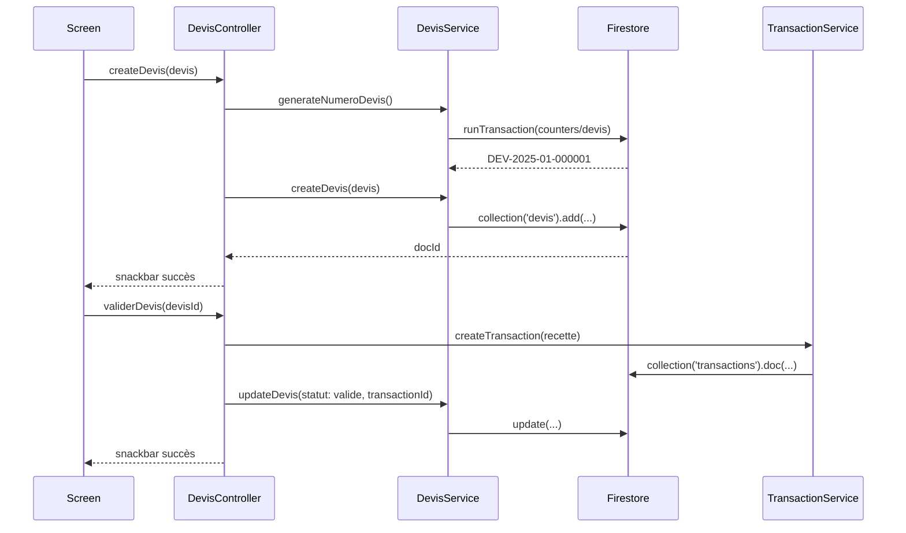

# Design Technique — Module Devis

## Overview

Le module Devis permet aux agents COREX de créer, gérer et exporter des devis commerciaux. Il s'intègre dans l'architecture existante Flutter Desktop + Web en suivant le pattern établi : **Model → Service (Firestore) → Controller (GetX) → Screen (Flutter)**.

Le module couvre :
- Création/édition/suppression de devis avec lignes de détail
- Numérotation automatique séquentielle (`DEV-YYYY-MM-XXXXXX`)
- Validation d'un devis → création automatique d'une transaction en caisse
- Conversion d'un devis validé en facture de stockage
- Export/impression PDF avec en-tête COREX
- Liste filtrée par statut avec chargement réactif

### Statuts du cycle de vie d'un devis

```
brouillon → envoye → valide → converti
                  ↘ refuse
```

---

## Architecture

Le module suit strictement le pattern existant du projet :

```
corex_shared/
  lib/
    models/
      devis_model.dart          ← DevisModel + LigneDevis
    services/
      devis_service.dart        ← CRUD Firestore + numérotation
    controllers/
      devis_controller.dart     ← GetX controller (état réactif)

corex_desktop/
  lib/
    screens/
      devis/
        devis_list_screen.dart  ← Liste + filtres par statut
        devis_form_screen.dart  ← Création / édition
        devis_detail_screen.dart← Détail + actions (valider, PDF, convertir)
```

### Flux de données



### Intégration dans main.dart

```
_safeInitialize('DevisService', () async => Get.put(DevisService(), permanent: true));
_safeInitialize('DevisController', () async => Get.put(DevisController(), permanent: true));
```

Route ajoutée dans `GetMaterialApp.getPages` :
```
GetPage(name: '/devis', page: () => const DevisListScreen()),
```

---

## Components and Interfaces

### DevisService

Interface publique :

| Méthode | Signature | Description |
|---|---|---|
| `generateNumeroDevis` | `Future<String>` | Génère `DEV-YYYY-MM-XXXXXX` via transaction Firestore sur `counters/devis` |
| `createDevis` | `Future<String> createDevis(DevisModel)` | Crée le document dans `devis/` |
| `updateDevis` | `Future<void> updateDevis(String id, Map<String, dynamic>)` | Met à jour des champs |
| `deleteDevis` | `Future<void> deleteDevis(String id)` | Supprime le document |
| `getDevisByAgence` | `Stream<List<DevisModel>> getDevisByAgence(String agenceId)` | Stream trié par `dateCreation` desc |
| `getDevisById` | `Future<DevisModel?> getDevisById(String id)` | Lecture unique |

### DevisController

État réactif exposé :

| Observable | Type | Description |
|---|---|---|
| `devisList` | `RxList<DevisModel>` | Liste complète de l'agence |
| `filteredList` | `RxList<DevisModel>` | Liste filtrée par statut |
| `isLoading` | `RxBool` | Indicateur de chargement |
| `selectedStatut` | `RxString` | Filtre actif (`tous`, `brouillon`, etc.) |
| `currentDevis` | `Rx<DevisModel?>` | Devis en cours d'édition |

Actions principales :

| Méthode | Description |
|---|---|
| `loadDevis()` | Souscrit au stream Firestore |
| `createDevis(DevisModel)` | Valide + crée via service |
| `updateDevis(String, Map)` | Met à jour si statut autorise |
| `deleteDevis(String)` | Supprime si statut autorise |
| `validerDevis(DevisModel)` | Valide + crée transaction |
| `convertirEnFacture(DevisModel)` | Crée FactureStockageModel |
| `genererPdf(DevisModel)` | Génère et imprime/exporte PDF |
| `setFiltreStatut(String)` | Met à jour `selectedStatut` et `filteredList` |

### Screens

**DevisListScreen** — liste paginée avec :
- Chips de filtre (Tous / Brouillon / Envoyé / Validé / Refusé / Converti)
- `ListView` de cartes avec numéro, client, montant, statut, date
- FAB pour créer un nouveau devis
- État vide avec bouton de création

**DevisFormScreen** — formulaire de création/édition :
- Champs : nom client, téléphone client, notes
- `ListView` de lignes (`LigneDevis`) avec désignation, quantité, prix unitaire
- Calcul automatique du total ligne et total devis en temps réel
- Bouton "Ajouter une ligne"
- Validation avant sauvegarde

**DevisDetailScreen** — fiche détail avec :
- Informations du devis (numéro, date, client, statut)
- Tableau des lignes
- Montant total
- Actions contextuelles selon statut :
  - `brouillon`/`envoye` → Modifier, Supprimer, Valider
  - `valide` → Convertir en facture, Imprimer PDF
  - `converti` → Lien vers facture, Imprimer PDF
  - Tous → Imprimer PDF

---

## Data Models

### DevisModel

```dart
class DevisModel {
  final String id;
  final String numeroDevis;       // DEV-YYYY-MM-XXXXXX
  final String clientNom;
  final String clientTelephone;
  final String agenceId;
  final String userId;
  final List<LigneDevis> lignes;
  final double montantTotal;      // Somme des totaux de lignes
  final String statut;            // brouillon | envoye | valide | refuse | converti
  final DateTime dateCreation;
  final DateTime dateModification;
  final DateTime? dateValidation;
  final String? transactionId;    // Rempli lors de la validation
  final String? factureId;        // Rempli lors de la conversion
  final String? notes;
}
```

### LigneDevis

```dart
class LigneDevis {
  final String designation;
  final double quantite;
  final double prixUnitaire;
  final double total;             // quantite × prixUnitaire (calculé)
}
```

### Collection Firestore : `devis`

```
devis/{devisId}
  numeroDevis: "DEV-2025-01-000001"
  clientNom: "Dupont SARL"
  clientTelephone: "+225 07 00 00 00"
  agenceId: "agence_abc"
  userId: "user_xyz"
  lignes: [
    { designation: "Transport", quantite: 2, prixUnitaire: 15000, total: 30000 }
  ]
  montantTotal: 30000
  statut: "brouillon"
  dateCreation: Timestamp
  dateModification: Timestamp
  dateValidation: null | Timestamp
  transactionId: null | "txn_id"
  factureId: null | "fact_id"
  notes: null | "..."
  createdAt: Timestamp
  updatedAt: Timestamp
```

### Compteur Firestore : `counters/devis`

Même mécanisme que `counters/facture_stockage` :
```
counters/devis
  count: 42
```

### Règles de transition de statut

| Statut actuel | Actions autorisées |
|---|---|
| `brouillon` | Modifier, Supprimer, Valider, Marquer envoyé |
| `envoye` | Modifier, Supprimer, Valider, Marquer refusé |
| `valide` | Convertir en facture, Imprimer PDF |
| `refuse` | Lecture seule, Imprimer PDF |
| `converti` | Lecture seule, Imprimer PDF |


---

## Correctness Properties

*A property is a characteristic or behavior that should hold true across all valid executions of a system — essentially, a formal statement about what the system should do. Properties serve as the bridge between human-readable specifications and machine-verifiable correctness guarantees.*

### Property 1: Format du numéro de devis

*For any* devis créé avec succès, le champ `numeroDevis` doit correspondre au pattern `DEV-YYYY-MM-XXXXXX` où `YYYY` est l'année courante, `MM` le mois courant (2 chiffres), et `XXXXXX` un entier positif sur 6 chiffres.

**Validates: Requirements 1.1, 7.1**

---

### Property 2: Round-trip sérialisation DevisModel

*For any* instance valide de `DevisModel`, la sérialisation via `toFirestore()` suivie de la désérialisation via `DevisModel.fromFirestore()` doit produire un objet équivalent (tous les champs identiques).

**Validates: Requirements 1.2**

---

### Property 3: Calcul du total d'une ligne

*For any* valeur de `quantite` (> 0) et `prixUnitaire` (>= 0), le champ `total` d'une `LigneDevis` doit être égal à `quantite × prixUnitaire`, et le `montantTotal` du devis doit être égal à la somme des `total` de toutes ses lignes.

**Validates: Requirements 1.3, 1.4**

---

### Property 4: Validation avant sauvegarde

*For any* tentative de sauvegarde d'un devis avec un `clientNom` vide (ou composé uniquement d'espaces) ou avec une liste `lignes` vide, la validation doit échouer et le devis ne doit pas être créé/modifié dans Firestore.

**Validates: Requirements 1.5, 1.6**

---

### Property 5: Statut initial brouillon

*For any* devis créé avec succès via `DevisService.createDevis()`, le champ `statut` doit être `brouillon` au moment de la création.

**Validates: Requirements 1.7**

---

### Property 6: Permissions de modification et suppression selon statut

*For any* devis, les opérations de modification et de suppression ne doivent être autorisées que si le statut est dans `{brouillon, envoye}`. Pour les statuts `valide` et `converti`, ces opérations doivent être rejetées par le controller.

**Validates: Requirements 2.1, 2.2, 2.4**

---

### Property 7: Suppression round-trip

*For any* devis existant dans Firestore, après appel de `DevisService.deleteDevis(id)`, une lecture de `DevisService.getDevisById(id)` doit retourner `null`.

**Validates: Requirements 2.3, 2.5**

---

### Property 8: Validation complète — statut, transaction et transactionId

*For any* devis en statut `brouillon` ou `envoye`, après une validation réussie : (a) le statut du devis doit être `valide`, (b) une transaction de type `recette` avec `categorieRecette == 'devis'` et `montant == devis.montantTotal` doit exister dans Firestore, (c) le champ `transactionId` du devis doit correspondre à l'identifiant de cette transaction, et (d) `dateValidation` doit être non-null.

**Validates: Requirements 3.1, 3.2, 3.3, 3.5**

---

### Property 9: Atomicité — rollback si la transaction échoue

*For any* devis dont la validation échoue lors de la création de la transaction (erreur simulée), le statut du devis doit rester inchangé (ne pas passer à `valide`).

**Validates: Requirements 3.4** *(edge-case)*

---

### Property 10: Conversion complète — statut converti et factureId

*For any* devis en statut `valide`, après une conversion réussie : (a) le statut du devis doit être `converti`, (b) le champ `factureId` doit être non-null et correspondre à une `FactureStockageModel` existante, (c) la facture créée doit contenir le `clientNom` et le `montantTotal` du devis.

**Validates: Requirements 4.1, 4.2, 4.3**

---

### Property 11: Conversion uniquement depuis statut valide

*For any* devis dont le statut est différent de `valide`, l'action de conversion doit être désactivée (`canConvert == false`).

**Validates: Requirements 4.4**

---

### Property 12: Contenu du PDF généré

*For any* devis, le PDF généré par `genererPdf()` doit contenir : le `numeroDevis`, le `clientNom`, le `clientTelephone`, chaque `designation` des lignes, le `montantTotal`, et la mention `COREX` avec la couleur verte `#2E7D32`.

**Validates: Requirements 5.1, 5.4**

---

### Property 13: Nom du fichier PDF

*For any* devis avec un `numeroDevis` donné, le nom du fichier PDF exporté doit être `Devis_[numeroDevis].pdf`.

**Validates: Requirements 5.3**

---

### Property 14: Tri par date de création décroissante

*For any* liste de devis chargée depuis Firestore via `getDevisByAgence()`, les éléments doivent être ordonnés par `dateCreation` décroissante (le plus récent en premier).

**Validates: Requirements 6.1**

---

### Property 15: Filtrage par statut

*For any* filtre de statut `s` (différent de `tous`) appliqué sur une liste de devis, tous les éléments de la liste filtrée doivent avoir `statut == s`, et aucun élément avec un statut différent ne doit apparaître.

**Validates: Requirements 6.2, 6.5**

---

### Property 16: Unicité des numéros de devis

*For any* ensemble de devis créés concurremment ou séquentiellement, tous les `numeroDevis` doivent être distincts (pas de doublons).

**Validates: Requirements 7.2**

---

## Error Handling

### Erreurs Firestore

| Scénario | Comportement attendu |
|---|---|
| Timeout lors de la création | `DevisController` affiche un snackbar d'erreur, le devis n'est pas ajouté à la liste réactive |
| Échec de la génération du numéro | `DevisService` utilise un UUID comme fallback et journalise l'erreur |
| Échec de la création de transaction lors de la validation | Rollback : le statut du devis reste inchangé, snackbar d'erreur affiché |
| Document inexistant lors de la mise à jour | Exception propagée, snackbar d'erreur |

### Erreurs de validation

| Scénario | Comportement attendu |
|---|---|
| `clientNom` vide ou whitespace | Validation échoue, message d'erreur sur le champ |
| Aucune ligne de devis | Validation échoue, message d'erreur global |
| `quantite` ou `prixUnitaire` négatif | Validation échoue, message d'erreur sur la ligne |
| Modification d'un devis verrouillé (`valide`/`converti`) | Action bloquée, snackbar explicatif |

### Erreurs PDF

| Scénario | Comportement attendu |
|---|---|
| Échec de génération PDF | `DevisController` affiche un snackbar d'erreur |
| Échec d'impression | Exception capturée, snackbar d'erreur |

### Pattern de gestion d'erreurs

Cohérent avec le reste du projet :
```dart
try {
  // opération
  Get.snackbar('Succès', 'Message de succès');
  return true;
} catch (e) {
  print('❌ [DEVIS_CONTROLLER] Erreur: $e');
  Get.snackbar('Erreur', 'Message d\'erreur: $e',
    backgroundColor: Colors.red, colorText: Colors.white);
  return false;
}
```

---

## Testing Strategy

### Approche duale

Le module utilise deux types de tests complémentaires :

- **Tests unitaires** : vérifient des exemples spécifiques, cas limites et conditions d'erreur
- **Tests de propriétés** : vérifient des propriétés universelles sur un large éventail d'entrées générées aléatoirement

### Tests unitaires

Focalisés sur :
- Exemples concrets de création/modification/suppression de devis
- Cas limites : devis avec une seule ligne, montant zéro, notes null
- Conditions d'erreur : Firestore indisponible, transaction échouée
- Intégration entre `DevisController` et `TransactionService`
- Génération PDF avec vérification du contenu

Fichiers de test suggérés :
```
corex_shared/test/
  models/devis_model_test.dart
  services/devis_service_test.dart
  controllers/devis_controller_test.dart
```

### Tests de propriétés (Property-Based Testing)

**Bibliothèque** : [`fast_check`](https://pub.dev/packages/fast_check) (Dart) — port de fast-check pour Dart.

**Configuration** : minimum 100 itérations par test de propriété.

**Format de tag** : chaque test de propriété doit inclure un commentaire de référence :
```dart
// Feature: devis-module, Property N: <texte de la propriété>
```

#### Mapping propriétés → tests PBT

| Propriété | Test PBT | Générateurs |
|---|---|---|
| P1 — Format numéro | Générer des dates aléatoires, vérifier le regex `DEV-\d{4}-\d{2}-\d{6}` | `Arbitrary<DateTime>` |
| P2 — Round-trip sérialisation | Générer des `DevisModel` aléatoires, sérialiser/désérialiser, comparer | `Arbitrary<DevisModel>` |
| P3 — Calcul total ligne | Générer des paires `(quantite, prixUnitaire)` positives, vérifier `total == q × p` et `montantTotal == sum(totaux)` | `Arbitrary<double>` |
| P4 — Validation avant sauvegarde | Générer des devis invalides (nom vide, lignes vides), vérifier rejet | `Arbitrary<String>` (whitespace) |
| P5 — Statut initial brouillon | Générer des devis valides, créer, vérifier `statut == brouillon` | `Arbitrary<DevisModel>` |
| P6 — Permissions selon statut | Générer des devis avec statuts aléatoires, vérifier `canEdit/canDelete` | `Arbitrary<String>` (statuts) |
| P7 — Suppression round-trip | Créer un devis, supprimer, vérifier `getDevisById == null` | `Arbitrary<DevisModel>` |
| P8 — Validation complète | Générer des devis valides, valider, vérifier statut + transaction + transactionId | `Arbitrary<DevisModel>` |
| P14 — Tri par date | Générer des listes de devis avec dates aléatoires, vérifier ordre décroissant | `Arbitrary<List<DevisModel>>` |
| P15 — Filtrage par statut | Générer des listes mixtes et un filtre, vérifier que tous les résultats ont le bon statut | `Arbitrary<String>` (statuts) |
| P16 — Unicité des numéros | Générer N créations séquentielles, vérifier que tous les numéros sont distincts | `Arbitrary<int>` (N) |

#### Exemple de test PBT (P3)

```dart
// Feature: devis-module, Property 3: total ligne = quantite × prixUnitaire
test('LigneDevis total equals quantite times prixUnitaire', () {
  fc.assert(
    fc.property(
      fc.double(min: 0.01, max: 10000),
      fc.double(min: 0, max: 1000000),
      (quantite, prixUnitaire) {
        final ligne = LigneDevis(
          designation: 'Test',
          quantite: quantite,
          prixUnitaire: prixUnitaire,
          total: quantite * prixUnitaire,
        );
        expect(ligne.total, closeTo(quantite * prixUnitaire, 0.001));
      },
    ),
    numRuns: 100,
  );
});
```

#### Exemple de test PBT (P15)

```dart
// Feature: devis-module, Property 15: filtrage par statut
test('Filtered list contains only devis with selected statut', () {
  final statuts = ['brouillon', 'envoye', 'valide', 'refuse', 'converti'];
  fc.assert(
    fc.property(
      fc.constantFrom(...statuts),
      fc.list(fc.constantFrom(...statuts), minLength: 0, maxLength: 20),
      (filtre, statutsListe) {
        final devisList = statutsListe.map((s) => DevisModel(..., statut: s)).toList();
        final filtered = devisList.where((d) => d.statut == filtre).toList();
        expect(filtered.every((d) => d.statut == filtre), isTrue);
      },
    ),
    numRuns: 100,
  );
});
```

### Couverture cible

| Composant | Tests unitaires | Tests PBT |
|---|---|---|
| `DevisModel` / `LigneDevis` | Sérialisation, cas limites | P2, P3 |
| `DevisService` | CRUD, numérotation, erreurs | P1, P7, P16 |
| `DevisController` | Validation, statuts, filtrage | P4, P5, P6, P8, P14, P15 |
| PDF generation | Contenu, nom fichier | P12, P13 |
| Intégration validation | Transaction + rollback | P8, P9 |
| Conversion en facture | Statut + factureId | P10, P11 |
